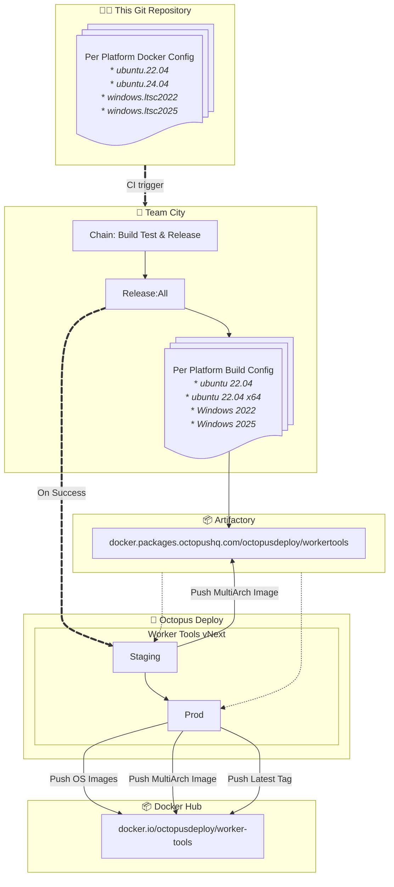

## Image Release Process

**Note: Unless a semantic version build tag is set on the commit being triggered, TeamCity will generate a pre-release build of the images. This should not go out to Production**

## 👷 Build
When a change is made to a file in this repository, TeamCity triggers the [full build chain](https://build.octopushq.com/buildConfiguration/OctopusDeploy_WorkerTools_ChainBuildTestAndRelease).
This results in a build of all the different distro's dockerfiles, as well as seperate architecture for non-windows os.

As part of this build process, individual images are pushed to the internal artifactory image repository.

## 🐙 Deploy
As the end of a successful build, a release is created in the [Worker Tools vNext](https://deploy.octopus.app/app#/Spaces-1163/projects/worker-tools-vnext/deployments?groupBy=Channel") Octopus Deploy Project.

This project takes the individually built images from Artifactory, and pushes them to a target repository as well as a multi-arch image to that same registry. As we create multiple architecture images for `Ubuntu 24.04` (amd64 and arm64), an additional `ubuntu.24.04` multi-arch image is created and pushed.

For the `Staging` environment the target is the same Artifactory registry where they are pushed during the build chain so then individual image push essentially becomes a no-op. The multi-arch images however will still be pushed.
For `Production` the target repository is the [public DockerHub registry](https://hub.docker.com/r/octopusdeploy/worker-tools).

## Flow Diagram

## Consumption in Octopus Deploy
When presented with the option to run an `Execution Container Image`, users can select this pre-built worker-tool image.

The list of images presented is dynamically retrieved from DockerHub and so, once the image has been pushed to `Production`, it potentially becomes the default image that customer will use when configuring a new step. 

Unfortunately if the image is not yet cached on the Dynamic Worker VM Image, cloud customers may find that the image pull process takes an unreasonable amount of time. For this reason, it is reccomended that pushing to `Production` is only done once the new image has been sucessfully cached in the available Dynamic Worker VM.

## Dynamic Worker Images
TODO: Add To This
