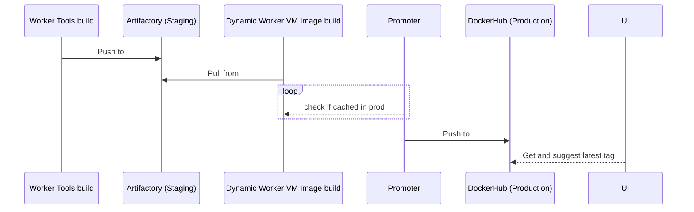
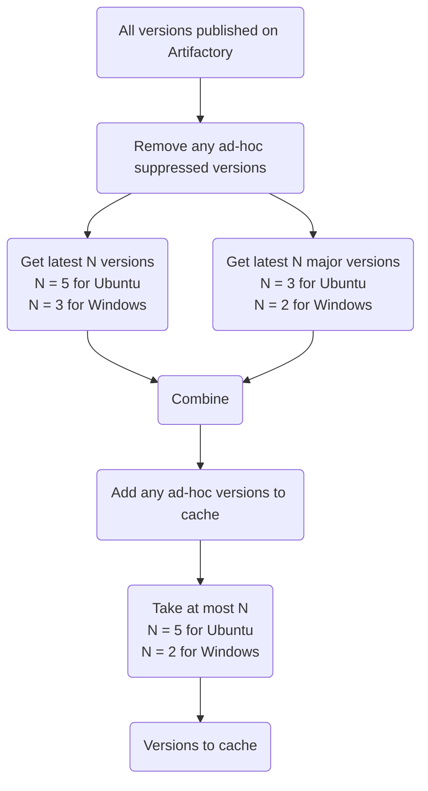

# Execution Container Images in Hosted Octopus

[Execution Containers](https://octopus.com/docs/projects/steps/execution-containers-for-workers) run Docker images like [Worker Tools](https://github.com/OctopusDeploy/WorkerTools). These container images provide a common tool set to support the execution of steps, and are pre-cached on [Dynamic Worker VMs](https://octopus.com/docs/infrastructure/workers/dynamic-worker-pools). This documentation describes some architectural designs for these images to improve user experience.

## How Execution Container Images are Released

Previously, when a new version of Worker Tools was created, it was released directly to DockerHub. This became immediately available to users but Dynamic Workers didn't have this version cached yet. Whenever a new Worker Tools image is published, there's a 1-2 week roll-out period where the latest image isn't cached on Dynamic Workers. This caused slow deployments for users updating their Worker Tools due to workers downloading the image. Additionally pushing images directly to DockerHub was also against the principles of Sensible Defaults.

To improve customer experience, changes to the Worker Tools release process have been made. We use [JFrog Artifactory](https://packages.octopushq.com/ui/packages) as the staging environment for releasing new images. A new image is first pushed Artifactory. The Dynamic Workers VM Image pipeline will pull from Artifactory to cache recent images and produce a VM image. Once this VM image is released, new Dynamic Workers will be created with the latest version of Worker Tools cached. The process of selecting versions of images to cache is described in the [next section](#which-versions-to-cache).

Since it can take weeks for the Dynamic Workers with the new image cached to reach all production reefs, we created an [Execution Container Promoter](https://github.com/OctopusDeploy/ExecutionContainersPromoter). The Promoter is a Runbook that periodically checks whether an image version has reached all production reefs, and publishes it to DockerHub if it has. The detailed working mechanism of the Promoter can be found in [repo](https://github.com/OctopusDeploy/ExecutionContainersPromoter).

Finally, once an image is promoted to DockerHub, we can say for sure that the version is readily cached for all production Dynamic Workers. The Octopus Server UI checks this registry to guide customers to use the latest version.

## Which Versions to Cache

When the Dynamic Worker VM images are built, the most recent versions of Worker Tools images will be pulled from Artifactory and cached. 

Previously, only one version of the images was cached. This caused long downloading time for some customers, especially those using Windows. We encouraged users to configure an absolute version number for Worker Tools. When this version was no longer the latest, slow deployments would occur.

To reduce the chance of introducing unexpected slow deployments, we now cache multiple versions of the Worker Tools. The [algorithm](https://github.com/OctopusDeploy/DynamicWorkerVmImages/blob/master/Win2019/scripts/cache-docker-images.ps1) depicted in the following diagram is used to select versions to cache, which balances the disk space on Dynamic Worker VMs and the popularity of the Worker Tools images being used.

